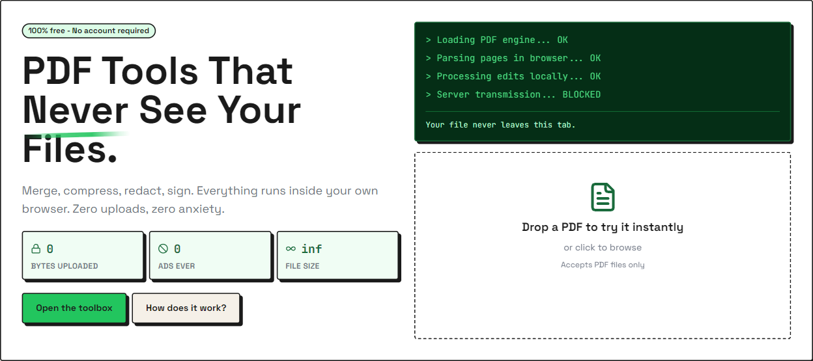
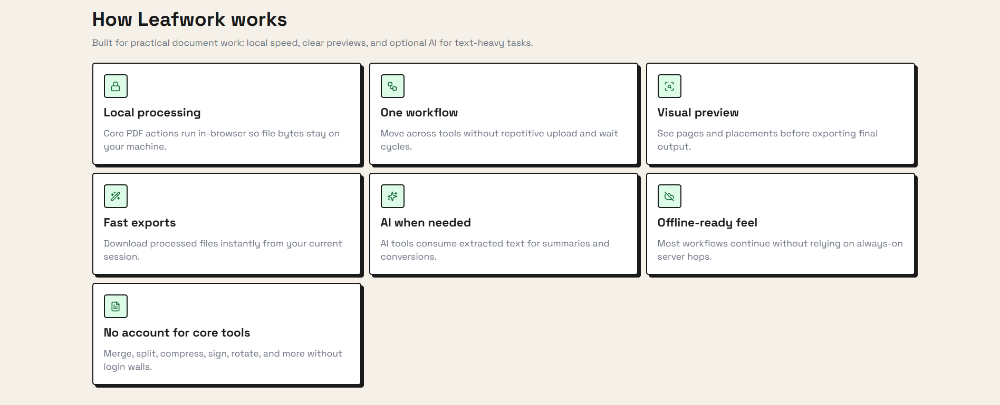
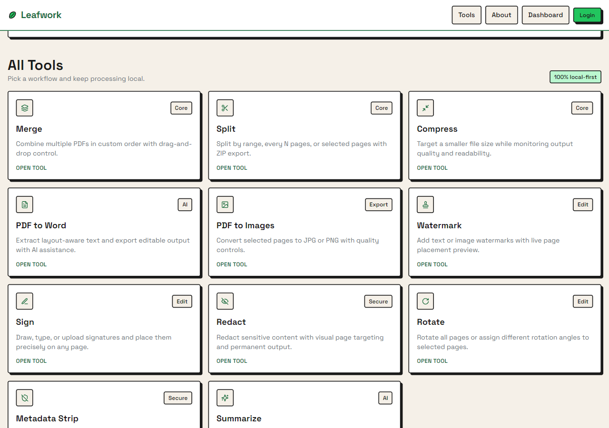
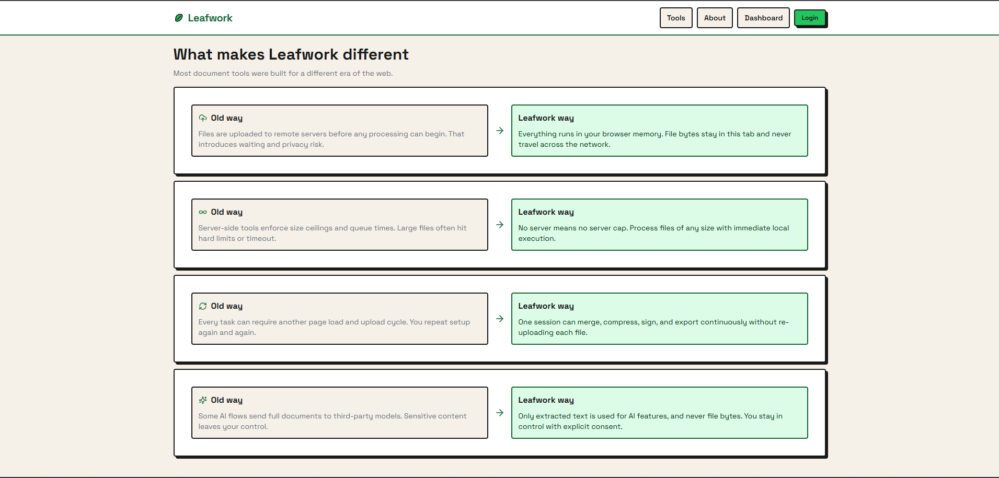

<div align="center">


# Leafwork - Free PDF Tools Online | Privacy-First PDF Editor

### Free Online PDF Tools - Merge PDF, Split PDF, Compress PDF, Sign PDF, Edit PDF in Browser

**Free PDF Merger · PDF Splitter · PDF Compressor · PDF Editor · PDF Signer · PDF Redactor · PDF Watermark · PDF to Word Converter · PDF to Image Converter · PDF Summarizer**

[](https://leafworkpdf.vercel.app)
[](https://nextjs.org)
[](https://www.typescriptlang.org)
[](LICENSE)
[](https://mozilla.github.io/pdf.js/)

<br />

<!-- SCREENSHOT: Full homepage hero — capture at 1440px wide, save as docs/images/hero.png -->


**🔒 100% Private** · **⚡ No Upload Required** · **🆓 Completely Free** · **📱 Works Offline** · **♾️ No File Size Limit** · **🔐 Sandboxed Execution**

[Try Free PDF Tools](https://leafworkpdf.vercel.app) · [View All PDF Tools](#free-pdf-tools) · [How It Works](#how-it-works)

</div>

---

## 📑 Table of Contents

- [Free PDF Tools - What is Leafwork?](#free-pdf-tools---what-is-leafwork)
- [How Online PDF Tools Work](#how-online-pdf-tools-work)
- [Free PDF Tools Available](#free-pdf-tools-available)
  - [Merge PDF Files Online Free](#merge-pdf-files-online-free)
  - [Split PDF Online Free](#split-pdf-online-free)
  - [Compress PDF Online Free](#compress-pdf-online-free)
  - [Sign PDF Online Free](#sign-pdf-online-free)
  - [Edit PDF Online Free](#edit-pdf-online-free)
  - [PDF to Word Converter Free](#pdf-to-word-converter-free)
  - [PDF to Image Converter](#pdf-to-image-converter)
- [Why Choose Leafwork PDF Tools?](#why-choose-leafwork-pdf-tools)
- [Technology Stack](#technology-stack)
- [Browser-Based PDF Processing Architecture](#browser-based-pdf-processing-architecture)
- [Open Source PDF Editor](#open-source-pdf-editor)
- [Privacy & Security](#privacy--security)
- [Frequently Asked Questions](#frequently-asked-questions)

---

## Free PDF Tools - What is Leafwork?

**Leafwork** is a **free online PDF editor** and **PDF toolkit** that works entirely in your browser. Unlike traditional online PDF tools that upload your files to a server, Leafwork processes everything locally using WebAssembly and PDF.js technology.

### Why Use Browser-Based PDF Tools?

✅ **No file upload required** - Your PDF files never leave your device  
✅ **100% free PDF tools** - No subscriptions, no hidden fees, no account required  
✅ **Unlimited file size** - No server means no file size restrictions  
✅ **Fast PDF processing** - Instant results without waiting for server processing  
✅ **Privacy-first PDF editor** - Your sensitive documents stay completely private  
✅ **Sandboxed browser execution** - All processing runs in isolated browser context for maximum security  
✅ **Works offline** - Process PDFs even without internet connection  
✅ **No watermarks** - Clean output files without branding  

```
> Loading PDF engine...           ✓ OK
> Parsing pages in browser...     ✓ OK
> Processing edits locally...     ✓ OK
> Server transmission...          ✗ BLOCKED
```

**Perfect for:**
- Merging multiple PDF files into one document
- Splitting large PDF files into smaller parts
- Compressing PDF file size for email
- Adding digital signatures to PDF documents
- Redacting sensitive information from PDFs
- Converting PDF to Word (DOCX) format
- Converting PDF pages to images (JPG, PNG)
- Adding watermarks to PDF files
- Rotating PDF pages
- Removing PDF metadata

---

## How Online PDF Tools Work

<!-- SCREENSHOT: FeatureGrid section — scroll to "How Leafwork works", capture at 1280px wide, save as docs/images/how-it-works.png -->


### Traditional PDF Tools vs Leafwork

| Feature | Traditional Online PDF Tools | Leafwork Browser-Based PDF Tools |
|---------|------------------------------|----------------------------------|
| **File Upload** | Required - files sent to server | Not required - stays in browser sandbox |
| **Privacy** | Files stored on remote servers | Files never leave your isolated browser context |
| **File Size Limit** | 5-50 MB typical limit | Unlimited - no server restrictions |
| **Processing Speed** | Slow - depends on server queue | Instant - sandboxed local processing |
| **Internet Required** | Yes - for upload and download | No - works offline after loading |
| **Cost** | Free | 100% free forever |
| **Watermarks** | Often added to free versions | Never - clean output always |
| **Security** | Files pass through third-party servers | Sandboxed execution in your browser |
| **Watermarks** | Often added to free versions | Never - clean output always |

### How Leafwork PDF Processing Works

1. **Drop PDF file** - Drag and drop your PDF into the browser
2. **Local processing** - PDF.js engine parses your document using WebAssembly
3. **Visual preview** - See real-time preview of changes before exporting
4. **Instant download** - Get your processed PDF immediately

**No upload. No waiting. No privacy concerns.**

---

## Free PDF Tools Available

<!-- SCREENSHOT: Full tool grid — scroll to "All Tools" section, capture at 1280px wide, save as docs/images/tool-grid.png -->


### Merge PDF Files Online Free

**[Free PDF Merger Tool](https://leafworkpdf.vercel.app/tools/merge)** - Combine multiple PDF files into one document

- Merge unlimited PDF files
- Drag and drop to reorder pages
- Combine PDFs from different sources
- No file size limit
- Preview before merging
- **Keywords:** merge pdf, combine pdf, join pdf files, pdf merger online free, merge pdf files, combine multiple pdfs

### Split PDF Online Free

**[Free PDF Splitter Tool](https://leafworkpdf.vercel.app/tools/split)** - Split PDF into multiple files

- Split by page range (e.g., pages 1-5)
- Extract specific pages
- Split every N pages
- Bulk split with ZIP export
- **Keywords:** split pdf, pdf splitter, extract pdf pages, divide pdf, separate pdf pages

### Compress PDF Online Free

**[Free PDF Compressor Tool](https://leafworkpdf.vercel.app/tools/compress)** - Reduce PDF file size

- Compress PDF without losing quality
- Reduce file size for email
- Optimize PDF for web
- Real-time quality preview
- **Keywords:** compress pdf, reduce pdf size, pdf compressor, shrink pdf, optimize pdf, make pdf smaller

### Sign PDF Online Free

**[Free PDF Signature Tool](https://leafworkpdf.vercel.app/tools/sign)** - Add digital signature to PDF

- Draw signature with mouse or touchscreen
- Type signature with custom fonts
- Upload signature image
- Place signature anywhere on PDF
- **Keywords:** sign pdf, pdf signature, esign pdf, digitally sign pdf, add signature to pdf

### Edit PDF Online Free

**[Free PDF Editor Tools](https://leafworkpdf.vercel.app/tools)**

#### Rotate PDF Pages
**[PDF Rotation Tool](https://leafworkpdf.vercel.app/tools/rotate)** - Rotate PDF pages 90, 180, or 270 degrees
- **Keywords:** rotate pdf, flip pdf, turn pdf pages

#### Add Watermark to PDF
**[PDF Watermark Tool](https://leafworkpdf.vercel.app/tools/watermark)** - Add text or image watermarks
- **Keywords:** watermark pdf, add watermark to pdf, pdf watermark tool

#### Redact PDF
**[PDF Redaction Tool](https://leafworkpdf.vercel.app/tools/redact)** - Permanently remove sensitive information
- **Keywords:** redact pdf, remove text from pdf, censor pdf, black out pdf

#### Remove PDF Metadata
**[PDF Metadata Remover](https://leafworkpdf.vercel.app/tools/metadata-strip)** - Strip author and creation data
- **Keywords:** remove pdf metadata, clean pdf properties, pdf metadata remover

### PDF to Word Converter Free

**[Free PDF to Word Converter](https://leafworkpdf.vercel.app/tools/pdf-to-word)** - Convert PDF to editable DOCX

- AI-powered layout preservation
- Extract text from PDF
- Export to Microsoft Word format
- Maintain formatting and structure
- **Keywords:** pdf to word, pdf to docx, convert pdf to word, pdf to word converter free, pdf to doc

### PDF to Image Converter

**[Free PDF to Image Converter](https://leafworkpdf.vercel.app/tools/pdf-to-images)** - Convert PDF pages to images

- Convert PDF to JPG
- Convert PDF to PNG
- Select specific pages
- Adjust image quality
- **Keywords:** pdf to jpg, pdf to png, pdf to image, convert pdf to image, pdf to jpeg converter

### PDF Summarizer AI

**[Free AI PDF Summarizer](https://leafworkpdf.vercel.app/tools/summarize)** - Generate PDF summaries with AI

- AI-powered document summarization
- Extract key points automatically
- Identify action items
- Generate executive summaries
- **Keywords:** pdf summarizer, summarize pdf, pdf summary tool, ai pdf reader

> **Privacy Note:** AI tools extract text locally in your browser and only send that text (not the PDF file) to the AI service.

---

## Why Choose Leafwork PDF Tools?

Most online PDF tools were built in the early 2000s when browsers couldn't process files locally. They require uploading your files to their servers, which creates privacy risks, file size limits, and slow processing times.

<!-- SCREENSHOT: Comparison table — scroll to "What makes Leafwork different", capture at 1280px wide, save as docs/images/comparison.png -->


### Leafwork vs Other PDF Tools

| Comparison | ILovePDF / Smallpdf / Adobe Online | Leafwork |
|------------|-------------------------------------|----------|
| **Privacy** | Files uploaded to company servers | Files never leave your browser |
| **File Size** | 5-50 MB limit on free tier | Unlimited - no restrictions |
| **Speed** | Slow - server queue delays | Instant - local processing |
| **Cost** | Free tier limited, $6-15/month paid | 100% free forever |
| **Watermarks** | Added on free tier | Never added |
| **Account Required** | Yes for most features | No - use immediately |
| **Offline Use** | No - requires internet | Yes - works offline |
| **Data Retention** | Files stored temporarily on servers | Never stored anywhere |

### Key Advantages of Browser-Based PDF Processing

🔐 **Maximum Privacy** - Your confidential documents never touch a server, processed in browser sandbox  
⚡ **Instant Processing** - No upload/download time, no server queue  
💰 **Always Free** - No premium tiers, no feature restrictions  
📦 **No Limits** - Process files of any size  
🌐 **Works Everywhere** - Any modern browser on any device  
🔌 **Offline Capable** - Process PDFs without internet  
🛡️ **Sandboxed Security** - Browser isolation protects your files from unauthorized access  

---

## Technology Stack

Leafwork is built with modern web technologies that enable powerful PDF processing directly in your browser:

| Technology | Purpose | Why It Matters |
|------------|---------|----------------|
| **[PDF.js](https://mozilla.github.io/pdf.js/)** | PDF rendering engine | Mozilla's open-source PDF parser - same engine used in Firefox |
| **[pdf-lib](https://pdf-lib.js.org)** | PDF manipulation | Create, modify, and save PDFs entirely in JavaScript |
| **WebAssembly** | High-performance computing | Near-native speed for PDF processing in browser |
| **[Next.js 14](https://nextjs.org)** | React framework | Modern web framework with App Router and Server Components |
| **[TypeScript](https://www.typescriptlang.org)** | Type safety | Catch errors before runtime |
| **[Tailwind CSS](https://tailwindcss.com)** | Styling | Brutalist design system for clean, accessible UI |
| **[Groq AI](https://groq.com)** | AI processing | Fast inference for PDF summarization and conversion |
| **[Supabase](https://supabase.com)** | Optional auth | Save workflows (optional feature) |
| **[Vercel](https://vercel.com)** | Hosting | Edge network for fast global access |

### Open Source PDF Libraries Used

- **pdfjs-dist** - PDF parsing and rendering (WebAssembly)
- **pdf-lib** - PDF creation and modification
- **docx** - DOCX file generation for PDF to Word
- **jszip** - ZIP file creation for batch exports
- **dnd-kit** - Drag and drop for page reordering
- **zustand** - State management
- **TanStack Virtual** - Virtualized rendering for large PDFs

---

## Browser-Based PDF Processing Architecture

### How PDF Files Are Processed Locally

```
User drops PDF file into browser
           ↓
File read as ArrayBuffer (stays in browser memory)
           ↓
PDF.js parses PDF structure (WebAssembly)
           ↓
Pages rendered as canvas elements
           ↓
User applies edits (merge, split, compress, etc.)
           ↓
pdf-lib modifies PDF structure
           ↓
New PDF generated as Uint8Array
           ↓
Browser downloads file directly
           ↓
Original file cleared from memory
```

**Zero network requests. Zero server storage. Zero privacy risk. Maximum sandbox security.**

### AI Features (Optional)

For AI-powered features like PDF summarization and PDF to Word conversion:

```
User clicks "Summarize" or "Convert to Word"
           ↓
Text extracted from PDF locally (in browser)
           ↓
Only extracted text sent to AI API (not the PDF file)
           ↓
AI processes text and returns result
           ↓
Result displayed or exported as DOCX
```

**Important:** Even for AI features, your PDF file never leaves your browser. Only the extracted text is sent to the AI service, and only when you explicitly click the AI feature button.

---

## Open Source PDF Editor

Leafwork is open source and available on GitHub. Developers can:

- Fork and customize for specific use cases
- Self-host on your own infrastructure
- Integrate PDF tools into existing applications
- Contribute new features and improvements
- Audit the code for security and privacy

### Contributing

We welcome contributions from the developer community:

```bash
# Fork the repository
git clone https://github.com/NA0XY/Leafwork.git

# Install dependencies
npm install

# Run development server
npm run dev

# Create feature branch
git checkout -b feature/your-pdf-tool

# Submit pull request
```

**Contribution ideas:**
- New PDF tools (extract tables, OCR, form filling)
- Performance optimizations
- Mobile UI improvements
- Accessibility enhancements
- Internationalization (i18n)
- Documentation improvements

### Project Structure

```
leafwork/
├── app/
│   ├── (marketing)/tools/       # All PDF tool pages
│   │   ├── merge/               # PDF merger
│   │   ├── split/               # PDF splitter
│   │   ├── compress/            # PDF compressor
│   │   ├── sign/                # PDF signature tool
│   │   ├── watermark/           # PDF watermark tool
│   │   ├── redact/              # PDF redaction tool
│   │   ├── rotate/              # PDF rotation tool
│   │   ├── pdf-to-word/         # PDF to Word converter
│   │   ├── pdf-to-images/       # PDF to image converter
│   │   └── summarize/           # AI PDF summarizer
│   └── api/ai/                  # AI endpoints (text-only)
├── components/
│   ├── canvas/                  # PDF rendering components
│   └── tools/                   # Tool-specific UI panels
├── hooks/
│   ├── usePDFEngine.ts          # PDF.js + pdf-lib orchestration
│   └── useDropZone.ts           # File drop handling
└── lib/
    ├── ai/                      # AI text extraction and processing
    └── documents/               # DOCX generation
```

### Key Components

- **PDFCanvas** - Renders PDF pages using PDF.js
- **usePDFEngine** - Manages PDF parsing and manipulation
- **AnnotationLayer** - Handles signatures, redactions, watermarks
- **PageGrid** - Virtualized grid for large PDFs
- **Tool panels** - UI for each PDF tool

---

## Privacy & Security

### Sandboxed Browser Execution

Leafwork runs entirely in your browser's sandboxed environment — a security feature built into all modern browsers that isolates web applications from your operating system and other applications.

**What is browser sandboxing?**
- Every web application runs in an isolated container
- Cannot access files outside the browser context without explicit permission
- Cannot interact with other applications or system processes
- Protects against malicious code and unauthorized file access

**Why this matters for PDF processing:**
- Your PDFs are processed in a security-isolated environment
- No external processes can access your documents during processing
- Files exist only in temporary browser memory, never touching the filesystem
- Even if our application were compromised, the sandbox prevents unauthorized access

### How We Protect Your Privacy

1. **No file upload** - Files are processed entirely in your browser's sandboxed memory
2. **No server storage** - We never see or store your files — they never leave the sandbox
3. **No tracking** - No analytics on file content or usage patterns
4. **No account required** - Use all core tools without registration
5. **Isolated execution** - Browser sandbox prevents access to your system or other applications
6. **Open source** - Audit the code yourself on GitHub

### Verify Privacy Yourself

You can verify that your files never leave your browser:

1. Open browser DevTools (F12)
2. Go to Network tab
3. Use any PDF tool
4. Observe: No network requests containing your file data

### Security Architecture

- **Sandboxed processing** - All operations run in isolated browser context
- **Memory-only handling** - Files exist only in volatile browser RAM
- **Automatic cleanup** - Files cleared from memory after processing
- **No persistent storage** - No cookies, localStorage, or IndexedDB for file data
- **HTTPS encryption** - Secure delivery of application code
- **Content Security Policy** - Prevents injection attacks and unauthorized code execution
- **Same-origin policy** - Browser enforces strict isolation from other domains

### GDPR & Compliance

Since your files never reach our servers:
- No data processing agreements needed
- No data retention policies apply
- No cross-border data transfer concerns
- No data breach risk from server compromise
- Perfect for handling sensitive, confidential, or regulated documents

**The sandbox is your guarantee:** Even if you don't trust our code, you can trust your browser's security model to keep your files isolated and private.
- No data breach risk
- No cross-border data transfer concerns
- Perfect for handling sensitive documents

---

## Frequently Asked Questions

### Is Leafwork really free?

Yes, 100% free forever. No premium tiers, no feature restrictions, no hidden costs.

### Do I need to create an account?

No account required for any PDF tools. Optional account available only for saving workflow templates.

### What file size can I process?

Unlimited. Since processing happens in your browser, there are no server-imposed file size limits. Performance depends on your device's RAM.

### Does it work offline?

Yes. After the initial page load, most tools work without internet connection.

### Which browsers are supported?

All modern browsers: Chrome, Firefox, Safari, Edge. Requires JavaScript and WebAssembly support.

### Can I use this for commercial purposes?

Yes. Leafwork is MIT licensed, which allows personal and commercial use, modification, and distribution.

### How do AI features work?

AI features (Summarize, PDF to Word) extract text from your PDF locally, then send only that text to Groq AI. Your PDF file never leaves your browser.

### Is my data secure?

Yes. Your files never leave your browser, so there's no data transmission or storage risk.

### Can I self-host Leafwork?

Yes. Clone the GitHub repository and deploy to your own infrastructure. The project is MIT licensed.

### How is this different from Adobe Acrobat?

Adobe Acrobat is desktop software ($180/year). Leafwork is free, browser-based, and requires no installation.

### How is this different from Smallpdf or ILovePDF?

Those services upload your files to their servers. Leafwork processes everything locally in your browser for maximum privacy.

---

## Keywords & Search Terms

**Primary Keywords:** free pdf tools, pdf editor online free, merge pdf, split pdf, compress pdf, pdf tools, online pdf editor, pdf converter, pdf merger, pdf splitter

**Secondary Keywords:** combine pdf, pdf to word, pdf to jpg, sign pdf online, edit pdf free, pdf compressor, reduce pdf size, pdf watermark, rotate pdf, pdf redaction

**Long-tail Keywords:** merge pdf files online free, split pdf online free no registration, compress pdf without losing quality, how to combine multiple pdf files, free pdf editor no watermark, pdf tools that don't upload files, privacy-first pdf editor, browser-based pdf tools, offline pdf editor, open source pdf tools

**Tool-specific Keywords:** pdf merger online, pdf splitter tool, pdf compression tool, digital signature pdf, pdf watermark remover, pdf metadata cleaner, pdf to docx converter, pdf to image converter, ai pdf summarizer

**Privacy Keywords:** secure pdf editor, private pdf tools, pdf editor no upload, confidential document editor, gdpr compliant pdf tools, pdf tools for sensitive documents, sandboxed pdf processing, browser sandbox pdf tools, open source pdf tools

**Technical Keywords:** webassembly pdf, pdf.js tools, browser pdf processing, client-side pdf editor, javascript pdf library, pdf-lib tools, local pdf processing, sandboxed browser execution, open source pdf editor

---

## License

**Proprietary License - All Rights Reserved**

Copyright © 2024 Leafwork. All rights reserved.

### Terms of Use

**Permitted:**
- ✅ Use the web application at leafworkpdf.vercel.app for personal purposes
- ✅ Use the web application for commercial document processing
- ✅ View source code for security auditing and transparency

**Not Permitted Without License:**
- ❌ Copy, modify, or redistribute the source code
- ❌ Create derivative works
- ❌ Self-host or deploy your own instance
- ❌ Use the code in other projects
- ❌ Remove or modify copyright notices

### Commercial Licensing

For commercial licensing, self-hosting, white-label solutions, or enterprise deployments, contact us at:

📧 **licensing@leafworkpdf.com**

### Third-Party Libraries

This project uses open-source libraries (PDF.js, pdf-lib, Next.js, etc.) which retain their original licenses. The proprietary license applies only to the Leafwork application code and does not supersede the licenses of these dependencies.

---

<div align="center">

## 🚀 Try Free PDF Tools Now

**[leafworkpdf.vercel.app](https://leafworkpdf.vercel.app)**

Merge PDF · Split PDF · Compress PDF · Sign PDF · Edit PDF · Convert PDF

**100% Free · No Upload · Privacy-First · Open Source**

---

Built with [Next.js](https://nextjs.org) · Powered by [PDF.js](https://mozilla.github.io/pdf.js/) · Hosted on [Vercel](https://vercel.com)

⭐ Star us on [GitHub](https://github.com/NA0XY/Leafwork) · 📖 [Documentation](#) · 🐛 [Report Bug](https://github.com/NA0XY/Leafwork/issues) · 💡 [Request Feature](https://github.com/NA0XY/Leafwork/issues)

</div>
